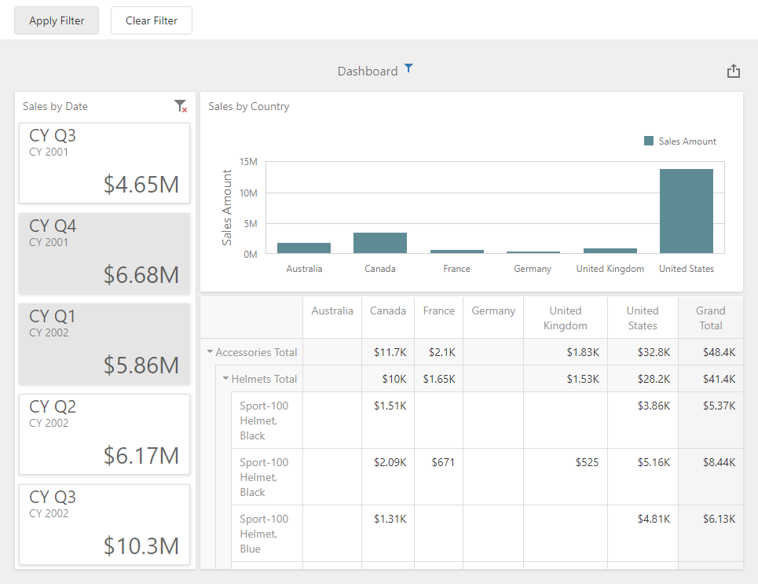

# Dashboard for Web Forms - How to apply Master Filtering in OLAP mode

The following example shows how to apply master filtering in ASPxDashboard on the client side when the dashboard is connected to an OLAP cube.

In this example, the [ViewerApiExtension.setMasterFilter](https://docs.devexpress.com/Dashboard/js-DevExpress.Dashboard.ViewerApiExtension?p=netframework#js_devexpress_dashboard_viewerapiextension_setmasterfilter_itemname_values_) method call applies the Master Filter values to the Card dashboard item. The [dxButton](https://js.devexpress.com/DevExtreme/ApiReference/UI_Components/dxButton/)'s `onClick` event handler calls this method.

## Files to Review

* [Default.aspx](./CS/ASPxDashboard_SetMasterFilter_Olap/Default.aspx) (VB: [Default.aspx](./VB/ASPxDashboard_SetMasterFilter_Olap/Default.aspx))
* [Default.aspx.cs](./CS/ASPxDashboard_SetMasterFilter_Olap/Default.aspx.cs) (VB: [Default.aspx.vb](./VB/ASPxDashboard_SetMasterFilter_Olap/Default.aspx.vb))
* [MasterFiltering.js](./CS/ASPxDashboard_SetMasterFilter_Olap/Scripts/MasterFiltering.js) (VB: [MasterFiltering.js](./VB/ASPxDashboard_SetMasterFilter_Olap/Scripts/MasterFiltering.js))

## Documentation

- [Client-Side API Overview for ASP.NET Web Forms Dashboard](https://docs.devexpress.com/Dashboard/116302/web-dashboard/aspnet-web-forms-dashboard-control/client-side-api-overview)
- [Master Filtering](https://docs.devexpress.com/Dashboard/117060/web-dashboard/create-dashboards-on-the-web/interactivity/master-filtering)

## More Examples

- [Dashboard for MVC - How to Apply Master Filter on the Client](https://github.com/DevExpress-Examples/mvc-dashboard-apply-master-filtering-in-code)
- [Dashboard for MVC - How to Drill-Down on the Client](https://github.com/DevExpress-Examples/mvc-dashboard-drill-down-in-code)
- [Dashboard for Web Forms - How to Drill-Down on the Client](https://github.com/DevExpress-Examples/asp-net-web-forms-dashboard-perform-drill-down-in-code)
- [Dashboard for Web Forms - How to Apply Master Filter on the Client](https://github.com/DevExpress-Examples/asp-net-web-forms-dashboard-apply-master-filter-in-code)
